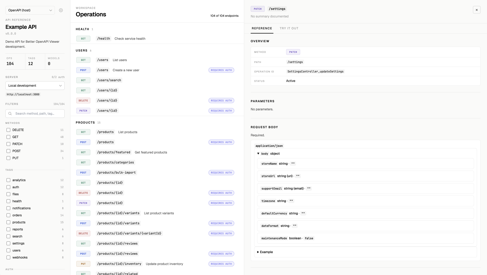
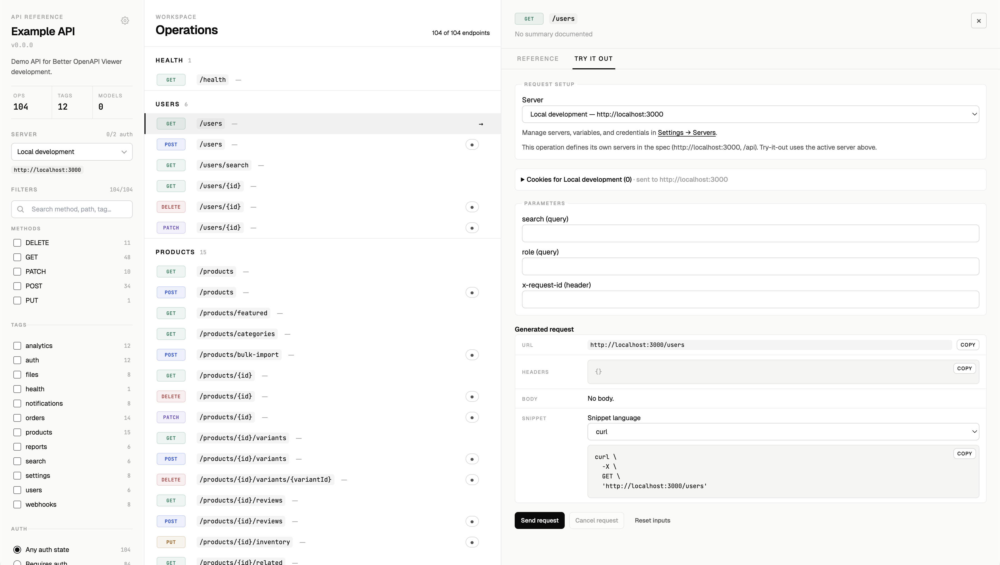
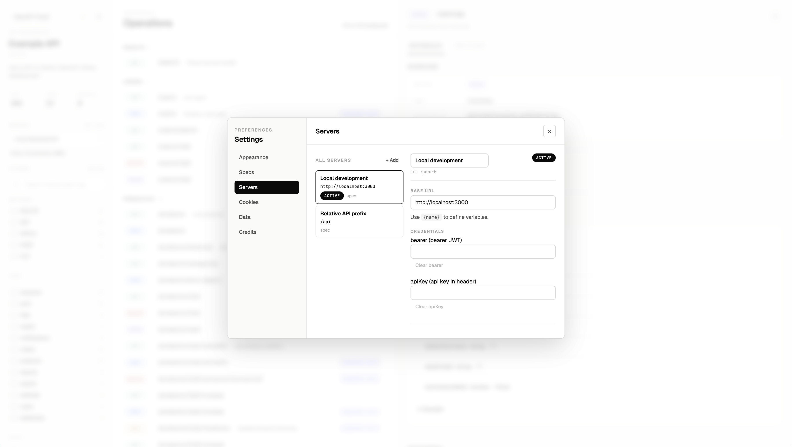
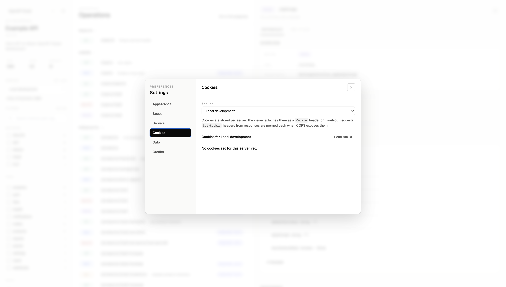

# Better OpenAPI Viewer

A richer, more usable OpenAPI reference and try-it-out client — built as a drop-in replacement for Swagger UI. Ships as a NestJS adapter today, with a framework-agnostic core designed for other adapters later.

---

## Table of contents

- [Screenshots](#screenshots)
- [Features](#features)
- [Packages](#packages)
- [Installation](#installation)
- [NestJS integration](#nestjs-integration)
  - [Minimal setup](#minimal-setup)
  - [Options reference](#options-reference)
  - [Multiple specs](#multiple-specs)
- [Use without NestJS](#use-without-nestjs)
  - [Standalone static page](#standalone-static-page)
  - [Drop-in browser bundle](#drop-in-browser-bundle)
  - [React component](#react-component)
  - [Add a spec from any running viewer](#add-a-spec-from-any-running-viewer)
- [Settings persistence and export/import](#settings-persistence-and-exportimport)
- [Development](#development)
- [Workspace layout](#workspace-layout)
- [Publishing](#publishing)

---

## Screenshots

**Operations list & Reference panel**


**Try it out**


**Settings → Servers** — configure base URL and per-server credentials (Bearer JWT, API key)


**Settings → Cookies** — manage per-server cookies that are forwarded on every try-it-out request


---

## Features

- **Operations sidebar** — all endpoints grouped by tag, searchable and filterable by HTTP method, tag, and auth state
- **Reference panel** — path, method, operation ID, parameters table (query / header / path), request body schema, response schemas, security requirements, and server list — all at a glance
- **Try it out** — fill parameters and a JSON body editor inline; sends the request from your browser with full header and cookie support
- **Per-server credentials** — bearer JWT and API key fields stored per server, applied automatically to every try-it-out request
- **Cookie jar** — add, edit, and delete cookies per server; the viewer attaches them as a `Cookie` header and merges incoming `Set-Cookie` response headers back (when CORS allows)
- **Generated snippets** — curl and other language snippets generated from the current inputs
- **Multiple specs** — mount several OpenAPI documents under one viewer with tab navigation
- **Add specs at runtime** — point the viewer at any reachable OpenAPI URL (JSON or YAML) from the in-app **Settings → Specs** tab; user-added specs are saved to `localStorage` and shared across viewer instances on the same origin
- **Export / import settings** — back up your preferences, user-added specs, saved servers, and (opt-in) credentials as a portable JSON file
- **Dark / light appearance** — follows the OS preference by default, overridable in Settings
- **Always in sync** — reads directly from your live OpenAPI JSON on every load, so there's no HTTP client collection (Postman, HTTPie, Insomnia, etc.) to keep up to date as your API evolves
- **Zero external CDN** — all assets (JS + CSS) are bundled and served from your own server

---

## Packages

| Package | Description |
|---|---|
| [`@clem/better-openapi-viewer-core`](packages/core) | Framework-agnostic OpenAPI normalisation and viewer primitives |
| [`@clem/better-openapi-viewer-ui`](packages/ui) | React viewer UI, published as both an npm package and a self-contained browser bundle |
| [`@clem/better-openapi-viewer-nestjs`](packages/nestjs) | NestJS adapter — mounts the viewer and serves the OpenAPI JSON |

---

## Installation

### NestJS

```bash
npm install @clem/better-openapi-viewer-nestjs
```

`@clem/better-openapi-viewer-core` and `@clem/better-openapi-viewer-ui` are bundled inside `@clem/better-openapi-viewer-nestjs` — you do not need to install them separately.

---

## NestJS integration

### Minimal setup

```ts
// main.ts
import { NestFactory } from '@nestjs/core';
import { DocumentBuilder, SwaggerModule } from '@nestjs/swagger';
import { setupBetterOpenApiViewer } from '@clem/better-openapi-viewer-nestjs';
import { AppModule } from './app.module.js';

async function bootstrap() {
  const app = await NestFactory.create(AppModule);

  const config = new DocumentBuilder()
    .setTitle('My API')
    .setVersion('1.0.0')
    .addBearerAuth()
    .build();

  const document = SwaggerModule.createDocument(app, config);

  setupBetterOpenApiViewer(app, {
    path: 'docs',          // viewer at /docs
    jsonPath: 'docs/openapi.json',
    document,
  });

  await app.listen(3000);
}

void bootstrap();
```

The viewer is then available at `http://localhost:3000/docs` and the raw OpenAPI JSON at `http://localhost:3000/docs/openapi.json`.

---

### Options reference

```ts
setupBetterOpenApiViewer(app, options)
```

| Option | Type | Default | Description |
|---|---|---|---|
| `path` | `string` | `'docs'` | URL path for the viewer UI |
| `jsonPath` | `string` | `'{path}/openapi.json'` | URL path for the OpenAPI JSON |
| `document` | `OpenAPIObject` | — | Pre-built OpenAPI document |
| `documentFactory` | `() => OpenAPIObject \| Promise<OpenAPIObject>` | — | Lazily-built document (alternative to `document`) |
| `cacheDocument` | `boolean` | `true` | Cache the document after first load (relevant for `documentFactory`) |
| `specs` | `BetterOpenApiViewerSpec[]` | — | Multiple specs — see below |
| `title` | `string` | document `info.title` | Page title and browser tab label |
| `customCss` | `string` | — | Inline CSS injected into the viewer page |
| `customCssUrl` | `string \| string[]` | — | External CSS URL(s) added as `<link>` tags |
| `customJs` | `string` | — | Inline JS injected at the bottom of the page |
| `customJsUrl` | `string \| string[]` | — | External JS URL(s) added as `<script>` tags |
| `faviconUrl` | `string` | — | URL for the page favicon |
| `defaultExpansion` | `'none' \| 'list' \| 'full'` | `'list'` | Initial expansion state for operation groups |
| `deepLinking` | `boolean` | `true` | Sync selected operation to the URL hash |
| `filter` | `boolean \| string` | `true` | Enable the search/filter bar |
| `displayRequestDuration` | `boolean` | `true` | Show request duration after try-it-out |
| `persistAuthorization` | `boolean` | `false` | Persist credentials in localStorage |
| `supportedSubmitMethods` | `string[]` | all methods | HTTP methods that show the Try it out button |
| `staticAssets` | `BetterOpenApiViewerStaticAssetsOptions \| false` | — | Override static asset serving |

---

### Multiple specs

Mount several OpenAPI documents under a single viewer path. Each spec gets its own URL and the viewer renders a navigation tab for each one.

```ts
setupBetterOpenApiViewer(app, {
  path: 'docs',
  specs: [
    {
      name: 'Public API',
      path: 'docs',                        // viewer at /docs
      jsonPath: 'docs/public.json',
      document: publicDocument,
    },
    {
      name: 'Internal API',
      path: 'docs/internal',               // viewer at /docs/internal
      jsonPath: 'docs/internal.json',
      documentFactory: () => buildInternalDocument(),
    },
  ],
});
```

| `specs` field | Type | Description |
|---|---|---|
| `name` | `string` | Display name shown in the spec navigation |
| `path` | `string` | URL path for this spec's viewer UI |
| `jsonPath` | `string` | URL path for this spec's OpenAPI JSON |
| `document` | `OpenAPIObject` | Pre-built document |
| `documentFactory` | `() => OpenAPIObject \| Promise<OpenAPIObject>` | Lazily-built document |
| `title` | `string` | Override the page title for this spec |

---

## Use without NestJS

NestJS is just one adapter — the viewer itself is framework-agnostic. There are three ways to run it without the NestJS package, depending on how much you want to host yourself.

### Standalone static page

The repo ships an `apps/standalone` build that produces three files (`index.html`, `viewer.js`, `viewer.css`). Drop them on any static host (GitHub Pages, Netlify, S3, `npx serve`, …) and you've got a viewer that can load any reachable OpenAPI document.

```bash
npm install
npm run build
# output → apps/standalone/dist/
```

Local preview:

```bash
npm run dev --workspace standalone
# then open http://localhost:4173
```

You can pre-load a spec via the URL:

```
https://your-host/?spec=https://api.example.com/openapi.yaml
https://your-host/?spec=https://api.example.com/openapi.json&name=My%20API&format=json
```

If no `?spec=` is provided, the viewer shows an empty state with a form to paste a URL. The spec is then saved to `localStorage` so you don't have to add it again.

### Drop-in browser bundle

`@clem/better-openapi-viewer-ui` ships a prebuilt browser bundle that renders the viewer from a plain HTML page — no React, no bundler, no build step required. This is what the NestJS adapter serves under the hood, and you can do the same from any HTTP server (Express, Fastify, Go, nginx, a Python script, …).

Install (or copy) the two files served alongside your HTML:

- `node_modules/@clem/better-openapi-viewer-ui/dist/browser/viewer.js`
- `node_modules/@clem/better-openapi-viewer-ui/dist/browser/viewer.css`

Then write an HTML page that points at one or more OpenAPI documents:

```html
<!doctype html>
<html lang="en">
  <head>
    <meta charset="utf-8" />
    <title>My API</title>
    <link rel="stylesheet" href="/static/viewer.css" />
  </head>
  <body>
    <div data-better-openapi-viewer-root></div>
    <script>
      window.__BETTER_OPENAPI_VIEWER_CONFIG__ = {
        // Single spec — the host serves this URL.
        jsonPath: '/openapi.json',

        // Or multiple specs — each appears as a tab.
        // specs: [
        //   { id: 'public',   name: 'Public API',   jsonPath: '/openapi/public.json' },
        //   { id: 'internal', name: 'Internal API', jsonPath: '/openapi/internal.json' },
        // ],

        title: 'My API',
        persistAuthorization: false,
      };
    </script>
    <script src="/static/viewer.js"></script>
  </body>
</html>
```

The bundle reads `window.__BETTER_OPENAPI_VIEWER_CONFIG__` on load, fetches the spec(s) from your origin, and mounts the viewer into the `[data-better-openapi-viewer-root]` element. The same UI options that NestJS forwards (`title`, `defaultExpansion`, `deepLinking`, `filter`, `persistAuthorization`, `customCss`, `customJs`, …) are valid here — see the [Options reference](#options-reference). User-added specs added via **Settings → Specs** work exactly the same.

### React component

If you already have a React app, install the UI package and render `<BetterOpenApiViewer />` directly. You control how the spec is loaded (bundled JSON, fetched, generated, …) and you can pass it in pre-parsed.

```bash
npm install @clem/better-openapi-viewer-ui react react-dom
```

```tsx
import { BetterOpenApiViewer } from '@clem/better-openapi-viewer-ui';
import '@clem/better-openapi-viewer-ui/browser-style';
import openapi from './openapi.json';

export function ApiDocsPage() {
  return (
    <BetterOpenApiViewer
      document={openapi}
      config={{ title: 'My API', defaultExpansion: 'list' }}
      persistAuthorization={false}
    />
  );
}
```

To let the viewer fetch one or more specs itself, skip `document` and pass `hostSpecs` instead:

```tsx
<BetterOpenApiViewer
  hostSpecs={[
    { id: 'public', name: 'Public API', jsonPath: '/openapi/public.json' },
    { id: 'internal', name: 'Internal API', jsonPath: '/openapi/internal.json', format: 'json' },
  ]}
  initialSpecId="public"
/>
```

| Prop | Type | Description |
|---|---|---|
| `document` | `OpenAPIObject` | A pre-parsed OpenAPI document for the active spec |
| `hostSpecs` | `HostSpec[]` | Specs the viewer should fetch itself; each has `id`, `name`, `jsonPath`, optional `format: 'auto' \| 'json' \| 'yaml'` |
| `initialSpecId` | `string` | ID of the spec to show on first load |
| `config` | `ViewerConfig` | Same UI options as the NestJS [Options reference](#options-reference) |
| `persistAuthorization` | `boolean` | Persist credentials in `localStorage` |
| `preauthorizedCredentials` | `TryItOutAuthCredentials` | Pre-fill bearer / API-key fields for try-it-out |

The component is the same one the NestJS adapter and the standalone bundle render — every feature (spec switcher, settings, cookie jar, export/import, dark mode) is available.

### Add a spec from any running viewer

Inside any running viewer (NestJS-mounted, standalone, or otherwise), open **Settings → Specs** and add a spec by URL (`.json` or `.yaml`). The viewer fetches it from the browser, so the host needs to send `Access-Control-Allow-Origin` for your origin.

When the viewer is mounted by NestJS, the host-provided spec(s) appear in the spec switcher with a `(host)` suffix and an unremovable **From host** badge in Settings → Specs. User-added specs sit alongside them and are fully editable.

---

## Settings persistence and export/import

All UI state lives in `localStorage` under the `better-openapi-viewer:*` namespace. Because `localStorage` is origin-scoped, your user-added specs and saved servers are shared across every viewer instance on the same host.

| Key | Contents |
|---|---|
| `better-openapi-viewer:prefs` | Theme, env scope, onboarding state |
| `better-openapi-viewer:user-specs` | User-added specs (URL + display name + format) |
| `better-openapi-viewer:last-spec` | ID of the spec the user last viewed |
| `better-openapi-viewer:servers:<spec>` | Saved servers per spec (URL + variables + credentials) |
| `better-openapi-viewer:cookies:<spec>:<server>` | Cookie jar per server per spec |
| `better-openapi-viewer:auth:<spec>` | Persisted auth credentials per spec (only when `persistAuthorization: true`) |

**Settings → Data** lets you export everything as a single JSON file and re-import it elsewhere:

- **Credentials are excluded by default.** A checkbox lets you opt-in to including bearer tokens, API keys, and cookies.
- Built-in NestJS-provided specs aren't included (they come from the host on reload); only an `id` / `name` hint is recorded.
- Import supports **merge** (additive) or **replace** (wipes all `better-openapi-viewer:*` keys first). The page reloads after import.

---

## Development

```bash
npm install        # install all workspace dependencies
npm run build      # build all packages
npm run dev        # build in watch mode (all packages in parallel)
npm run pack:check # dry-run npm pack for all publishable packages
```

The example app (`apps/example-nest`) starts the viewer at `http://localhost:3000/docs` with 100+ demo endpoints covering varied schemas, auth schemes, and header requirements.

```bash
cd apps/example-nest
npm run start:dev
```

---

## Workspace layout

```
packages/
  core/    – OpenAPI normalisation, types, framework-agnostic helpers
  ui/      – React viewer (also builds a self-contained browser bundle)
  nestjs/  – NestJS adapter
apps/
  example-nest/  – development sandbox with 100+ demo endpoints
```

---

## Publishing

All three packages are versioned together. Adapters pin exact versions of `core` so published packages always work as a matched set.

```bash
npm run pack:check   # verify what would be published
npm publish --workspace @clem/better-openapi-viewer-core
npm publish --workspace @clem/better-openapi-viewer-ui
npm publish --workspace @clem/better-openapi-viewer-nestjs
```
